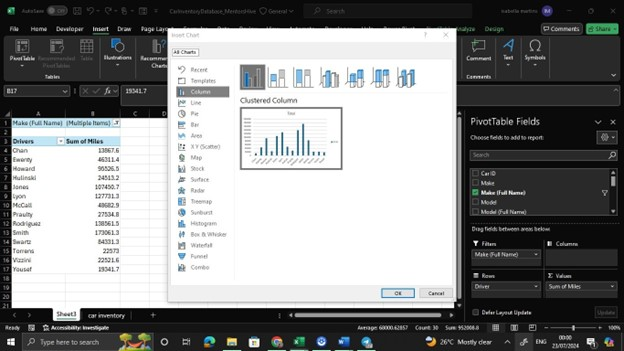

# Car-Inventory-Analysis
## INTRODUCTION
This project is to display my data cleaning, transformation and visualization skill using Excel. This is an Excel project on sales analysis of an imaginary Car Retail Store called HireHawks Motors.
### Disclaimer: 
All datasets and reports do not represent any company, institution, or country, but are just dummy datasets to demonstrate my capabilities in Excel.
## PROBLEM STATEMENT
I was presented with a car dealership's inventory dataset. The data is not formatted ideally, with the car ID squeezed into a single cell and color information potentially spread across multiple columns. The Chief Marketing Officer (CMO) wants to leverage this data for marketing purposes and needs insights into the car inventory.
## SKILLS AND CONCEPT DEMONSTRATED
The following Excel features were incorporated:
* Creating new columns
* Use of Text Functions
* Removing duplicates
* Sorting data
* Creating Lookup Table
* Pivot tables
* Data Visualization
## DATA SOURCE
Dummy data Set I got on GitHub.
### Data Description:
*	The dataset includes information about the car dealership's inventory.
*	Columns include:
  + carId (combined car identifier, needs processing)
  + Make (extract the make of the car)
  + Make (Full Name)
  + Model (extract the model of the car)
  + Model (Full Name)
  + Manufacture Year
  + Miles/year
  + Warranty Miles covered and not covered
### ADDITIONAL CAR DETAILS 
#### CAR MAKE 
*	FD	Ford
*	CR	Chryster
*	GM	General motors
*	HO	Honda
*	HY	Hyundai
*	TY	Toyota

#### CAR MODEL 
#### Model full name
*	CAM	Camry
*	CAR	Caravan
*	CIV	Civic
*	CMR	Camero
*	COR	Corolla
*	ELA	Elantra
*	FCS	Focus
*	MTG	Mustang
*	ODY	Odessy
*	PTC	PT cruiser
*	SLV	Silverado

## Tasks:
### 1.	Data Cleaning and Formatting:
+	Extract the car ID information from the carId column into separate columns for Make, Model, and Manufacture Year.
+	Handle potential inconsistencies or missing data in the extracted columns.
+	Remove duplicates, handling duplicates.

### 2.	Data Analysis:
+	Calculate the current age of each car.
+	Calculate the average miles driven per year for each car.
+	Identify cars still under warranty based on Warranty Miles and current mileage.
+	Develop a new unique car ID for the CMO by concatenating the first three letters (uppercase) of Make, Model, Manufacture Year, and the first three letters (uppercase) of the primary Color.

### 3.	Data Visualization:
* Create visualizations to show:
  + Total number of cars in the inventory.
  + Breakdown of cars by model and make (potentially a stacked bar chart).
  + Total miles driven by car model (potentially a bar chart).
  + Warranty coverage status by car model (potentially a pie chart or bar chart).
  + Distribution of car colors by make (potentially a stacked bar chart).
### 4.	Additional Analysis:
*	Identify the top 5 car models with the highest total mileage driven.
*	Find the oldest and youngest car in the inventory based on Manufacture Year.

## DATA CLEANING AND TRANSFORMATION

### TASK 1: Data Cleaning and Formatting:
*	Extract the car ID information from the carId column into separate columns for Make, Model, and Manufacture Year.
*	Handle potential inconsistencies or missing data in the extracted columns.
*	Remove duplicates, handling duplicates.

RAW DATASET

Highlight dataset; go to data tab and in data tools, click on  remove duplicates.
There were duplicates in the data, the duplicates were removed.

### TASK 2 Data Analysis:
*	Calculate the current age of each car.
*	Calculate the average miles driven per year for each car.
*	Identify cars still under warranty based on Warranty Miles and current mileage.
*	Develop a new unique car ID for the CMO by concatenating the first three letters (uppercase) of Make, Model, Manufacture Year, and the first three letters (uppercase) of the primary Color.

 **Use the Left Function to extract the make.** 
 LEFT(text, [num_chars])
•	Extracts a specified number of characters from the beginning of a text string (text).
•	num_chars (optional) specifies the number of characters to extract. If omitted, it defaults to 1 (extracts the first character).

**Create a Lookup Table for Car Make and Model Names**
To map car codes to their full names, I created two separate lookup tables:
***Car Make Lookup Table***
This table contains two columns:
* The car make code (e.g., "FD", "TY")

* The corresponding full name (e.g., "Ford", "Toyota")

**Car Model Lookup Table**
Similarly, this table contains:
* The car model code (e.g., "CAM", "CIV")
* The corresponding full model name (e.g., "Camry", "Civic")

Formula: =VLOOKUP(B2,$B$57:$C$62,2)

**B2:** This is the lookup value. The function will search for the value in cell B2.

**$B$57:$C$62:** This is the lookup range. The function will search within the range B57:C62. The dollar signs ($) indicate absolute references, meaning the range will not change if the formula is copied to another cell.

The search will occur in the first column of this range, which is column B.

This is the column index number. It specifies which column in the lookup range contains the value to be returned. Since the range is B57:C62 and you specified 2, the function will return the value from the second column of the range, which is column C.

**What the Formula Does**
*	The VLOOKUP function looks for the value in cell B2 in the first column of the range B57:B62.
*	Once it finds a match, it returns the corresponding value from the second column of the range (C57:C62).
If you don’t Lock the Formula you get N/A or REF error so ensure you lock he formula.

##### Repeat the same sequence for car Model

#### Extract manufactured date 

**MID(text, start_num, num_chars)**
Extracts a specified number of characters from the middle of a text string (text).
*	start_num specifies the starting position of the extraction within the text string.
*	num_chars specifies the number of characters to extract.

#### CALCULATE THE CURRENT AGE OF THE CAR

You get a negative error, which isn’t supposed to be; if yoU use the **current year - manufactured year** seeing that some cars are over 75 years ago.

Right formula to calculate current age of car
**=IF(24-F3<0,100-F3+24,24-F3)**
Lets break down this formula

**Explanation**
The formula uses the IF function to determine if a subtraction operation results in a negative value and adjusts accordingly based on a 100-year scale.
**Formula: =IF(24-F3<0,100-F3+24,24-F3)**
***1.	Condition: 24-F3<0:***
*	This part checks if subtracting the value in cell F3 from 24years results in a negative number.
*	If F3 is greater than 24years, the result will be negative.
***2.	True Part: 100-F3+24:***
*	If the condition 24-F3<0 is true (meaning F3 is greater than 24), the formula returns 100-F3+24.
*	This handles the situation where the year F3 is after the year 24 but is on a 100-year scale (for example, F3 might be a year in a 100-year cycle, like 75).
***3.	False Part: 24-F3:***
*	If the condition 24-F3 is false (meaning F3 is less than or equal to 24), the formula returns 24-F3.
*	This handles the situation where the year F3 is before or equal to the year 24.

#### Formula to see if warranty miles still covers or not

#### Formular for new car ID

### TRANSFORMED DATA SET

### TASK 3 :
#### Creating a Pivot Table from the Data
**1.	Select the Data Range:**
*	Click on any cell within your data range or select the entire data range, e.g., A1:N21.
**2.	Insert Pivot Table:**
*	Go to Insert > PivotTable.
*	Ensure the data range is correctly filled in, e.g., A1:N21.
*	Choose to place the pivot table in a new worksheet.
*	Click OK.

**3. Build your Pivot Table**

*	In the PivotTable Field List:
  + Drag Make to the Rows area to list the car makes.
  + Drag Model to the Rows area to list car models under each make.
  + Drag Miles to the Values area to summarize the total miles for each make and model.
  + Drag Color to the Columns area if you want to see the distribution of colors for each make and model.

